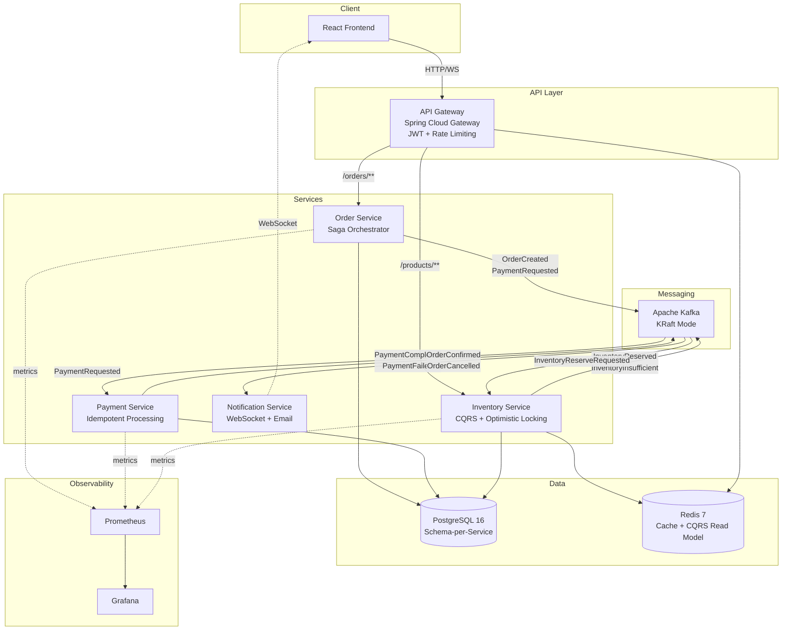
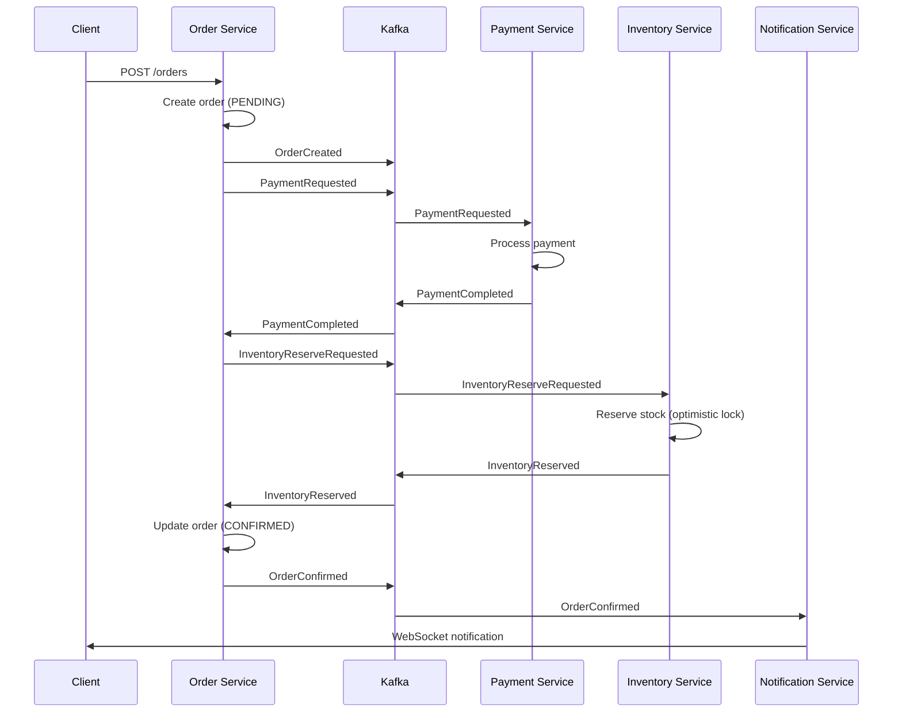
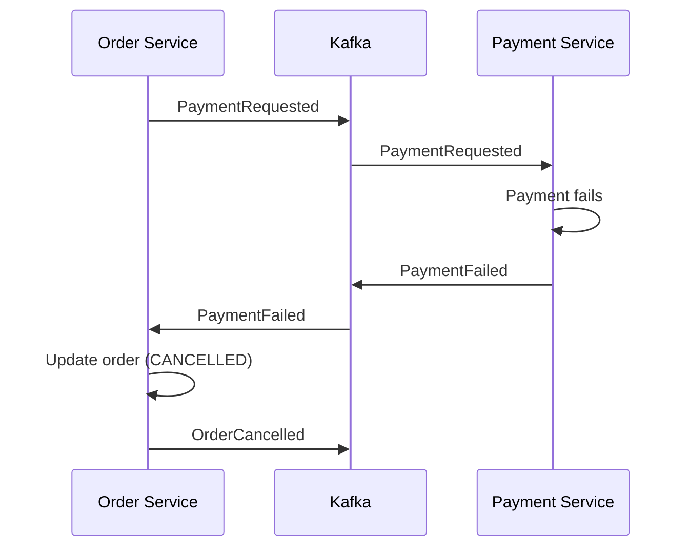
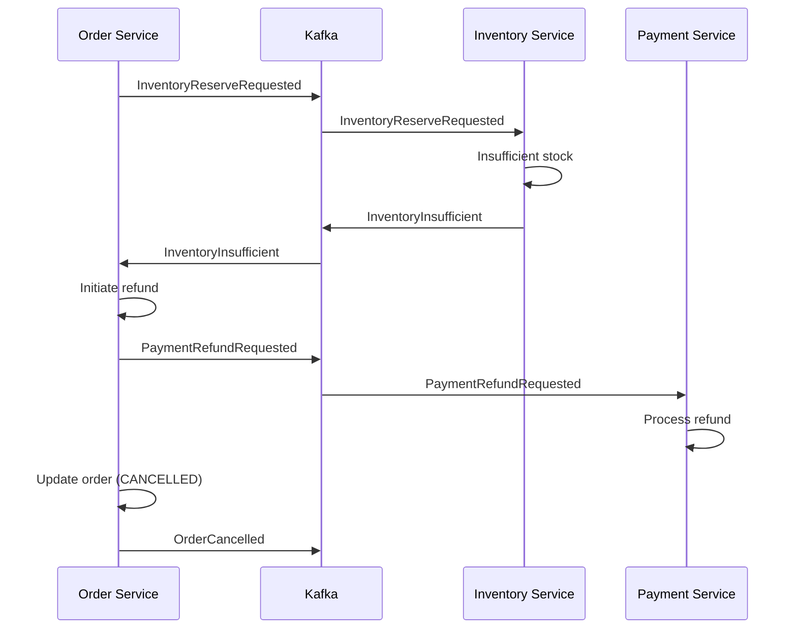

# Nexus

Event-driven e-commerce microservices platform demonstrating distributed systems mastery with Saga orchestration, CQRS, and real-time order tracking.

## Architecture



## Saga Flow

### Happy Path



### Compensation (Payment Failed)



### Compensation (Inventory Insufficient)



## Quick Start

```bash
# Clone and start everything — Docker Compose handles the rest
git clone https://github.com/AdrianoVS87/nexus.git
cd nexus
docker compose up -d

# Verify services are healthy
curl http://localhost:8080/actuator/health | jq .

# Open the frontend
open http://localhost:5173
```

## Happy Path — End to End

```bash
# 1. List available products
curl -s http://localhost:8080/api/v1/products | jq .

# 2. Place an order
curl -s -X POST http://localhost:8080/api/v1/orders \
  -H "Content-Type: application/json" \
  -d '{
    "userId": "550e8400-e29b-41d4-a716-446655440000",
    "items": [
      {
        "productId": "a1b2c3d4-e5f6-7890-abcd-ef1234567890",
        "productName": "Mechanical Keyboard",
        "quantity": 1,
        "unitPrice": 149.99
      }
    ]
  }' | jq .

# 3. Check order status (replace ORDER_ID with the id from step 2)
curl -s http://localhost:8080/api/v1/orders/{ORDER_ID} | jq .

# 4. Connect to WebSocket for real-time updates
websocat ws://localhost:8080/ws/orders
```

## Key Design Decisions

**Orchestration-based Saga over Choreography.**
The Order Service acts as a central orchestrator that drives each saga step in sequence. This makes the transaction flow explicit, easy to trace, and straightforward to extend with new compensation logic. In a choreography approach, the flow is scattered across consumers and harder to reason about when debugging production incidents.

**CQRS for the Inventory Service.**
Product catalog reads vastly outnumber writes. By separating the write model (PostgreSQL with optimistic locking) from the read model (Redis), the system serves high-throughput product listing queries from cache without contending with stock reservation writes.

**Idempotency keys for payment processing.**
Network partitions and consumer retries are inevitable in a distributed system. Every payment request carries a unique idempotency key so the Payment Service can safely deduplicate retries and guarantee exactly-once processing semantics.

**Kafka in KRaft mode (no ZooKeeper).**
KRaft eliminates the operational overhead of running a separate ZooKeeper ensemble. The metadata quorum runs inside the Kafka brokers themselves, simplifying deployment, reducing infrastructure footprint, and aligning with the Apache Kafka project's long-term direction.

## Tech Stack

| Layer | Technology | Version |
|-------|-----------|---------|
| Language | Java | 21 (LTS) |
| Framework | Spring Boot | 3.4 |
| API Gateway | Spring Cloud Gateway | 2024.0 |
| Messaging | Apache Kafka (KRaft) | 3.7 |
| Database | PostgreSQL | 16 |
| Cache/CQRS | Redis | 7 |
| Frontend | React + TypeScript + Vite | 18 / 5 / 6 |
| Tracing | OpenTelemetry | 1.36 |
| Metrics | Micrometer + Prometheus | - |
| Resilience | Resilience4j | 2.2 |
| Migrations | Flyway | 10 |
| Testing | JUnit 5 + Testcontainers | - |
| CI/CD | GitHub Actions | - |

## API Documentation

See [docs/API.md](docs/API.md) for the full API reference.

## Project Structure

```
nexus/
├── order-service/          # Saga orchestrator + order management
├── payment-service/        # Payment processing with idempotency
├── inventory-service/      # CQRS stock management
├── notification-service/   # WebSocket + email notifications
├── api-gateway/            # JWT auth + rate limiting + routing
├── web/                    # React frontend
├── infra/                  # Prometheus + Grafana configs
├── .github/workflows/      # CI pipeline
└── docker-compose.yml      # Full stack orchestration
```

## License

[MIT](LICENSE)
