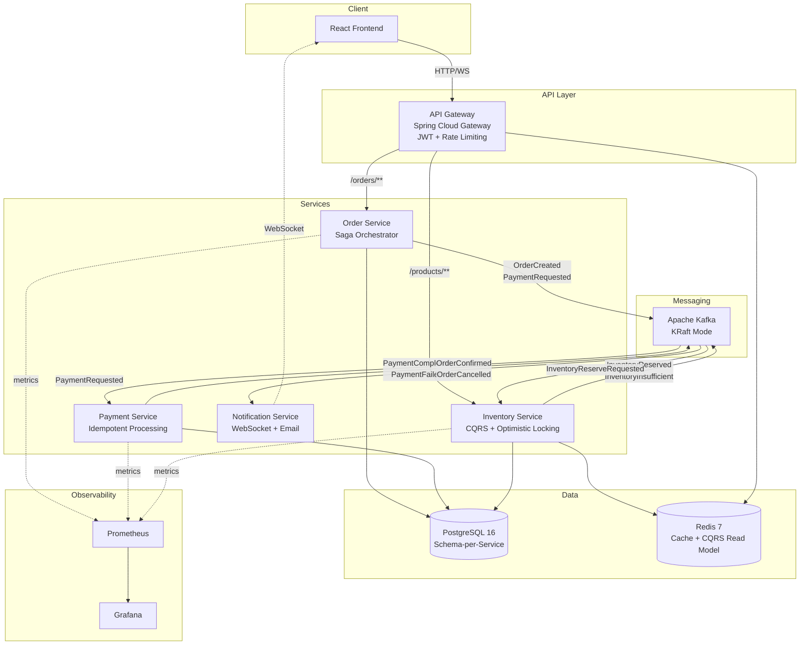
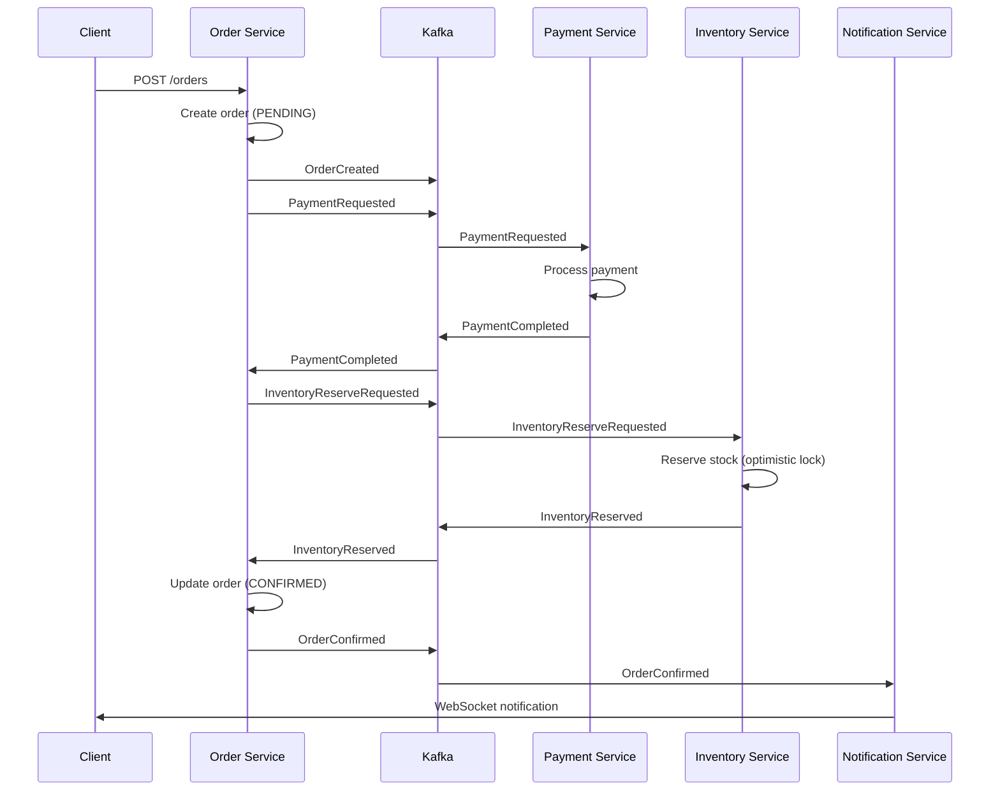
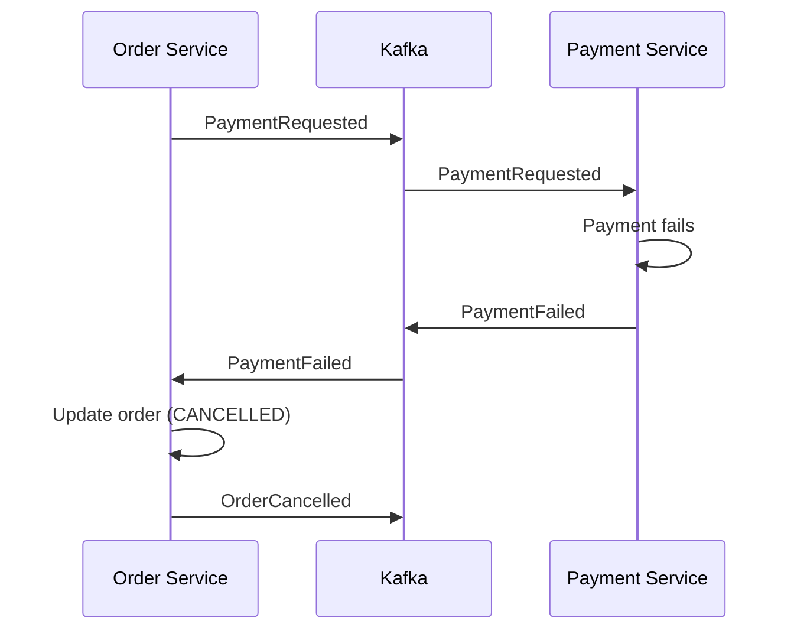
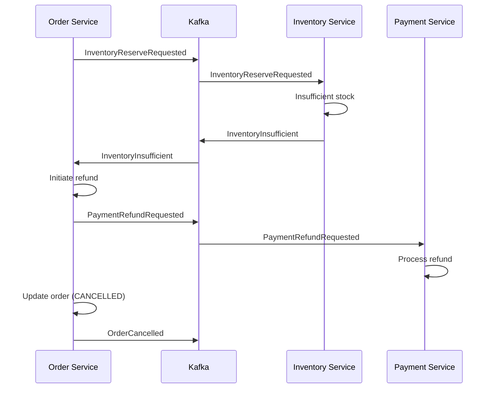

# Nexus

Event-driven e-commerce microservices platform demonstrating distributed systems mastery with Saga orchestration, CQRS, and real-time order tracking.

## Architecture



## Saga Flow

### Happy Path



### Compensation (Payment Failed)



### Compensation (Inventory Insufficient)



## Quick Start

```bash
# Clone the repository
git clone https://github.com/AdrianoVS87/nexus.git
cd nexus

# Start all services + infrastructure
docker-compose up -d

# Verify services are healthy
curl http://localhost:8080/actuator/health  # API Gateway
curl http://localhost:8081/actuator/health  # Order Service
curl http://localhost:8082/actuator/health  # Payment Service
curl http://localhost:8083/actuator/health  # Inventory Service

# Open frontend
open http://localhost:5173
```

## Tech Stack

| Layer | Technology | Version |
|-------|-----------|---------|
| Language | Java | 21 (LTS) |
| Framework | Spring Boot | 3.4 |
| API Gateway | Spring Cloud Gateway | 2024.0 |
| Messaging | Apache Kafka (KRaft) | 3.7 |
| Database | PostgreSQL | 16 |
| Cache/CQRS | Redis | 7 |
| Frontend | React + TypeScript + Vite | 18 / 5 / 6 |
| Tracing | OpenTelemetry | 1.36 |
| Metrics | Micrometer + Prometheus | - |
| Resilience | Resilience4j | 2.2 |
| Migrations | Flyway | 10 |
| Testing | JUnit 5 + Testcontainers | - |
| CI/CD | GitHub Actions | - |

## API Documentation

See [docs/API.md](docs/API.md) for full API reference.

## Project Structure

```
nexus/
├── order-service/          # Saga orchestrator + order management
├── payment-service/        # Payment processing with idempotency
├── inventory-service/      # CQRS stock management
├── notification-service/   # WebSocket + email notifications
├── api-gateway/            # JWT auth + rate limiting + routing
├── web/                    # React frontend
├── infra/                  # Prometheus + Grafana configs
├── .github/workflows/      # CI pipeline
└── docker-compose.yml      # Full stack orchestration
```

## License

[MIT](LICENSE)
